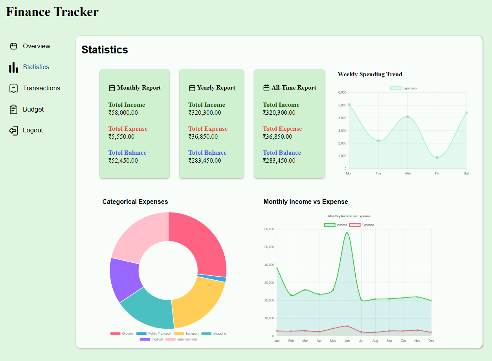
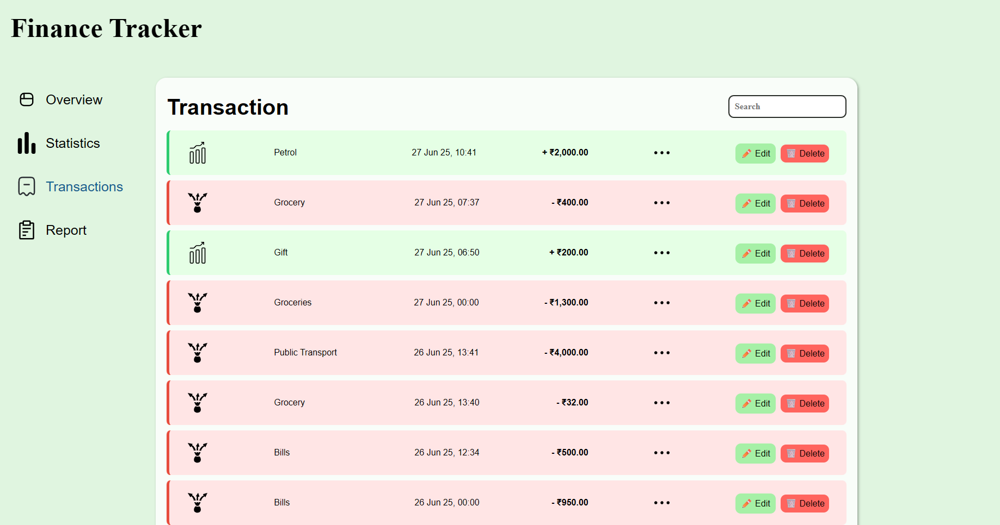
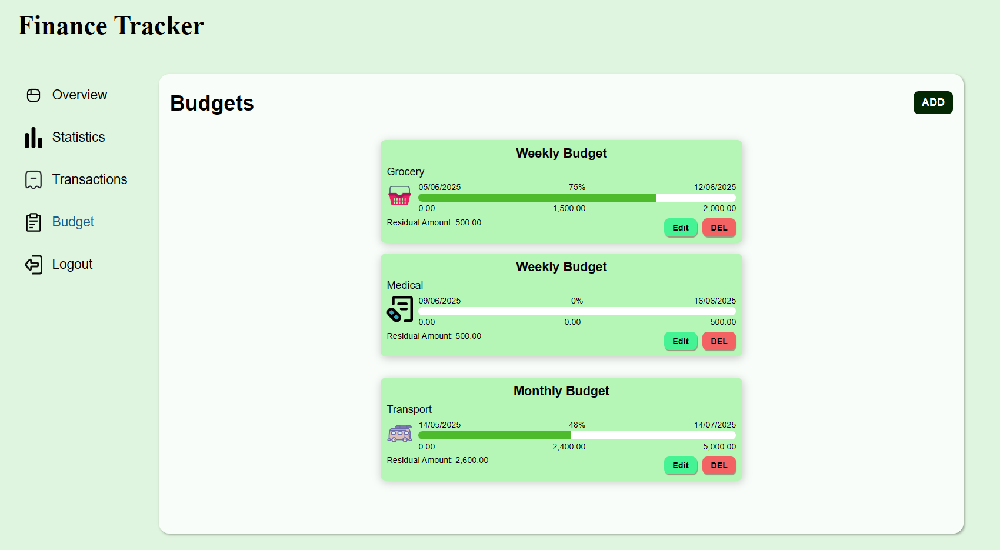
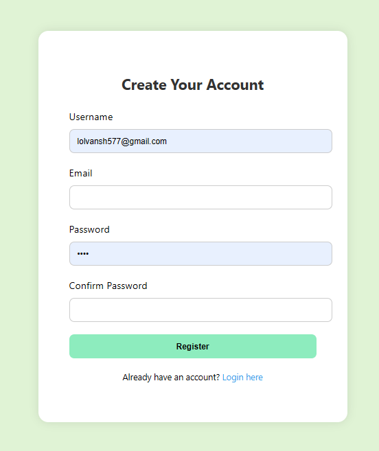
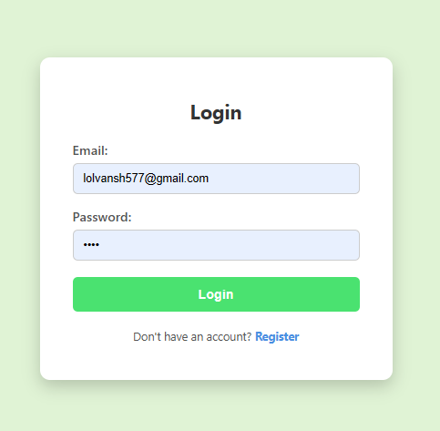

# Personal-Finance-Tracker
A finance tracker which will account for your income and expense in a user friendly way.

A responsive web application to help you track your income, expenses, and financial activity in a simple dashboard format. Built with HTML, CSS, JavaScript, PHP, and MySQL.

## Features

- 📊 Dashboard with total income, total expenses, and balance
- ➕ Add new income and expense entries
- 🗃 View recent transactions with type, date, and amount
- 🔄 Dynamic PHP + MySQL integration
- 💾 Data storage with secure database operations
- 📱 Responsive and intuitive user interface

## Tech Stack

- **Frontend**: HTML5, CSS3, JavaScript
- **Backend**: PHP (Procedural)
- **Database**: MySQL
- **Server**: XAMPP / Apache (for local testing)

dont know what to add below the quick buttons lemme think
## 📃 Dashboard Page

## 📊 Stats Page

## 💸 Transactions Page

## 📅 Budget Page

## 📝 Register Page

## 🔐 Login Page
